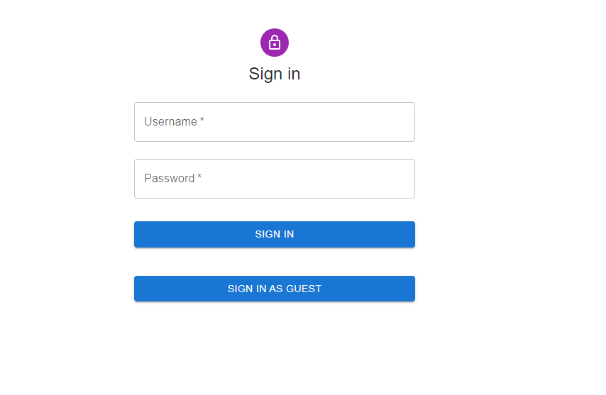
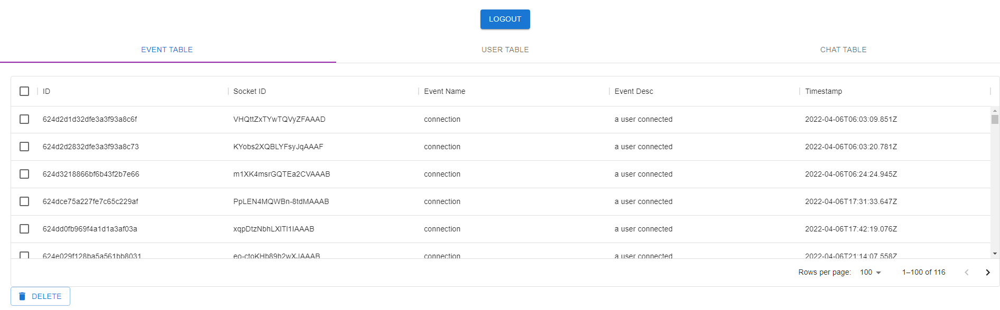

# Full-Stack-Project

BCDV1007 - Full Stack Chat Application

## Backend Setup

- Setup the backend project https://github.com/Tarandeep100/Full-Stack-Project
- Open the backend app http://localhost:8080/
- Use the application to enter some data in the database

## Frontend Setup

Clone the project

```bash
  git clone https://github.com/Tarandeep100/Full-Stack-2.git
```

Go to the project directory

```bash
  cd Full-Stack-2\Full-Stack-2-Project\my-app
```

Install dependencies

```bash
  npm install
```

Start the frontend-server (port: 3000)

```bash
  npm start
```

## Author

- [@Tarandeep100](https://github.com/Tarandeep100/)

## Screenshots



